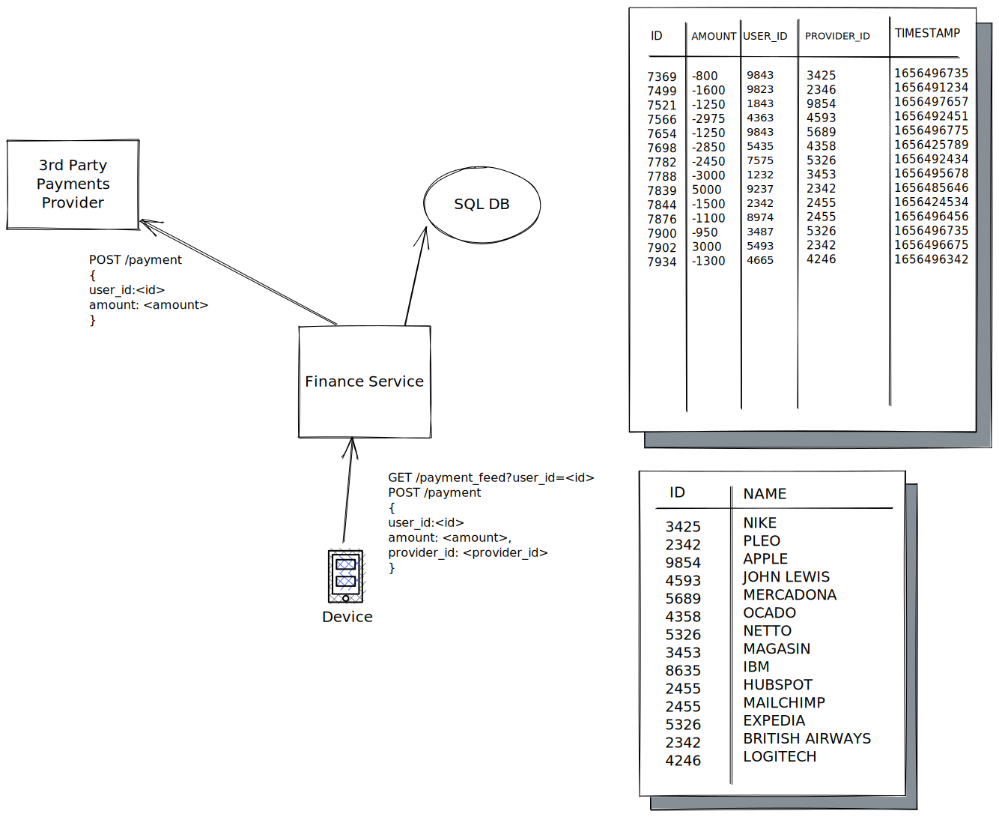

# Take a home challenge

## Introduction

Pleo uses a microservice architecture, in which the whole system architecture is divided into smaller systems to provide granular functionality. One of these subsystems is the “Finance Service” whose business goal is to provide wallet information and be able to make payments. Currently, this service exposes a REST interface with two endpoints:

- Fetch payments feed with the wallet balance from the user. Each payment describes the amount paid and to which provider
- Create a new payment

As you can see there is only one instance of the “Finance Service” running, which is exposed directly to the internet. On the storage layer, there is an SQL-like database that contains two tables. One table tracks the wallet payments and the other contains provider information.



([source](https://excalidraw.com/#json=s7Z93k3QuPNb1Iq7qSVAi,EYw_hjaB5OYg2KESC6geqQ))

### Payment feed response example

```jsx
{
	"user_id": 3456,
	"balance": 2000,
	"transactions" : [
		{
			"id": 7844,
			"name": "Pleo",
			"amount": 5000,
			"timestamp": 1656477038
		},
		{
			"id": 7855,
			"name": "Apple",
			"amount": -3000,
			"timestamp": 1656487348
		}
	]
}
```

## Tasks

You have been tasked to scale Pleo from a tiny service with a few users to a system that should be able to serve thousands of customers concurrently. 

The goal of this challenge is to describe **what changes would you do to the system to support exponential growth** and **how will you make sure the system works as expected with those changes**. The task is intentionally vague but there are some things to have in mind:

- This service deals with money and it should be as reliable as possible
- You can assume there is only one 3rd Party Payment processor and it only deals with adding or subtracting funds from the user and it can recognize the `user_id` sent by the Finance Service.
- We don’t have control over the scalability of the 3rd party system but we can suggest improvements or changes in the API. The external service does not offer any staging or sandbox environment.
- We would like to scale to be able to support millions of stored users and in the range of ~10000 peak concurrent users. The external payment processor has a limit in the hundreds of payments per second.
- You can assume that the volume of *write* operations (process a payment) will always be lower than the volume of *read* operations (checking balance)

## How to submit the solution

In order to evaluate your solution, you can share a technical design that describes what assumptions were taken, what components are involved, how they communicate, and how you would you load test it. Internally Pleo uses the [Design Doc template](Template-Design-Doc.md),  but feel free to modify the template structure or use the format of your choice. 

Bear in mind that there is no single solution to this challenge, and it could be improved indefinitely. From Pleo, we are conscious of your time and we don’t aim to have a complete answer but to know how you would reason if this was a real scenario. If you choose to adopt an iterative approach, you can fork this repo with your solution. Ideally we would like to see a commit on each new advance on the challenge so we can evaluate the journey to the solution. Feel free to go as big or small as you want.